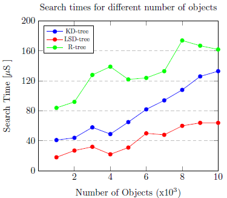

# Parallel R-tree search algorithm

This repo contains the codebase for a parallel R-tree search algorithm implemented in C. The R-tree in question is a "static" R-tree variant - the Sort-Tile-recursive (STR) R-tree. The tree is implemented in-memory and makes used of randomly generated rectangles as polygon inputs.

The R-tree search performance is compared to that of the KD-tree, where the KD-tree makes use of the *Co-ordinate Transformation Storage* (CTS) search algorithm. CTS is essentially a conversion mechanism which transforms k-dimensional objects ie. a line, rectangle, or cube etc. into a single point in a 2k-dimensional space, such that the point can be stored in a search efficient point-storing data structure, such as the KD-tree or LSD-tree.

Below are the simulation results of a search for 1000-10000 rectangle objects. The test is run on a single cluster node with an Intel Xeon E3-1270 CPU with 16GB RAM. The results show the CTS method applied to the LSD-tree and KD-tree achieve atleast a 2x speedup in search time than the R-tree.

  

